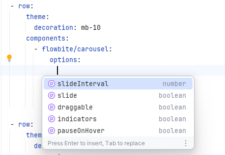

<!-- TOC -->
* [Getting started](#getting-started)
  * [Installation](#installation)
  * [Running generation scripts](#running-generation-scripts)
    * [Applying JSON schema to a Yaml file](#applying-json-schema-to-a-yaml-file)
  * [Configuring Tailwind](#configuring-tailwind)
  * [Integration in Nodoku skin Yaml file](#integration-in-nodoku-skin-yaml-file)
* [Component's default theme](#components-default-theme)
* [Nodoku skin component customization](#nodoku-skin-component-customization)
  * [Customization of sequential components](#customization-of-sequential-components)
* [Applying Flowbite theme](#applying-flowbite-theme)
* [The nodoku-fowbite components](#the-nodoku-fowbite-components)
  * [flowbite/card](#flowbitecard)
<!-- TOC -->

**_nodoku-flowbite_** is a set of visual components to be used with the [Nodoku static site generator](https://github.com/nodoku/nodoku-core).

The components provided in the **_nodoku-flowbite_** library are based on [flowbite](https://github.com/themesberg/flowbite) and [flowbite-react](https://github.com/themesberg/flowbite-react).

The components in the nodoku-flowbite library are styled using Tailwind CSS.

All the Nodoku components support localization out of the box. 

One needs to provide the i18n provider parameter to the Nodoku root component - RenderingPage.

See [nodoku-i18n](https://github.com/nodoku/nodoku-i18n) for more details 

# Getting started

## Installation

The installation of the nodoku-flowbite library is straightforward:

```shell
npm install nodoku-core nodoku-flowbite
```

## Running generation scripts

Once the installation is performed, one needs to run the following scripts in order to generate the [Nodoku component resolver](https://github.com/nodoku/nodoku-core?tab=readme-ov-file#nodoku-component-resolver) and [Nodoku skin schema](https://github.com/nodoku/nodoku-core?tab=readme-ov-file#schema-for-nodoku-skin-yaml-file).  

In brief, running the scripts would consist of the following steps:
- [add the scripts](https://github.com/nodoku/nodoku-core?tab=readme-ov-file#nodoku-generation-scripts) to the package.json file
  - ```json
    "scripts": {
      "gen-component-resolver": "nodoku-gen-component-resolver",
      "gen-skin-schema": "nodoku-gen-skin-schema"
    },
    ```
- run the scripts as follows:
  - ```shell
    ./gen-component-resolver
    ./gen-skin-schema
    ```
  


After the generation scripts are executed, the following new files should appear in the project tree:

- **_src/nodoku-component-resolver.ts_**
  - the file resolving the textual names of the components to an actual JS function implementing the compoent


- **_schemas/visual-schema.json_**
  - this JSON file is a schema to be used for Nodoku skin Yaml file. 

The component resolver should be having the following lines now:

```ts
components.set("flowbite/card", { ... });
components.set("flowbite/horizontal-card", { ... });
components.set("flowbite/carousel", { ... });
components.set("flowbite/jumbotron", { ... });
```
### Applying JSON schema to a Yaml file
There are several techniques to apply the JSON schema to a Yaml file, and they in particular depend on your development environment.

For example, [this link](https://www.jetbrains.com/help/idea/yaml.html#json_schema) shows the steps to follow for IntelliJ family products.

Alternatively, one can consider using the following option: add the following line to the top of the Yaml where the schema should be applied:

```yaml
# yaml-language-server: $schema=../../../schemas/visual-schema.json
```

like this:

```yaml
# yaml-language-server: $schema=../../../schemas/visual-schema.json

rows:
  - row:
      components:
        - flowbite/carousel:

```

## Configuring Tailwind

nodoku-flowbite is a library of Nodoku visual components, based on flowbite and react-flowbite.

**_flowbite_** and **_react-flowbite_** are the libraries heavily relying on Tailwind CSS, and so is **_nodoku-flowibte_**.

Here is the Tailwind CSS config to be used with the project:

```ts
import flowbite from "flowbite-react/tailwind";
import type {Config} from "tailwindcss";

const config: Config = {
    content: [
        "./src/**/*.ts",
        "./src/**/*.tsx",
        "./src/**/*.js",
        "./src/**/*.jsx",
        "./schemas/**/*.yml",

        "./node_modules/nodoku-core/dist/esm/**/*.js",
        "./node_modules/nodoku-core/dist/esm/**/*.jsx",
        "./node_modules/nodoku-components/dist/esm/**/*.js",
        "./node_modules/nodoku-components/dist/esm/**/*.jsx",
        "./node_modules/nodoku-flowbite/dist/esm/**/*.js",
        "./node_modules/nodoku-flowbite/dist/esm/**/*.jsx",
        "./node_modules/nodoku-flowbite/dist/schemas/**/*.yml",
        "./public/**/*.html",
        "./src/**/*.{html,js}",
        "./public/site/**/*.yaml",
        flowbite.content(),
    ],
    plugins: [
        flowbite.plugin(),
    ],
};


export default config;

```

The main point behind this config is to make the Tailwind plugin to scan all the places where the Tailwind classnames can potentially be encountered.

This includes not only the .js/.jsx files that the bundle contains, but also the Yaml files that the bundle brings in, as the Yaml files contain the default theme configuration of a bundle in terms of Tailwind classes.

Let's have a closer look at the paths contained in the Tailwind config:

- **_./src/\*\*/\*(.ts|.tsx|.js|.jsx)_**
  - these are the files that belong to your project. They should be scanned only if they use Tailwind themselves


- **_./schemas/\*\*/\*.yml_**
  - after the skin schema generation (see [Nodoku skin schema](https://github.com/nodoku/nodoku-core?tab=readme-ov-file#schema-for-nodoku-skin-yaml-file)) this folder would contain not only the JSON schema for the Nodoku skin Yaml file (**_schemas/visual-schema.json_**), but also the default themes for the components, contained in the plugged in bundles (such as nodoku-flowbite). This folder should be included because otherwise all the default values for the component themes wouldn't be scanned, and the CSS for them wouldn't be generated by Tailwind.


- **_./node_modules/nodoku-flowbite/dist/esm/\*\*/\*(.js|.jsx)_**
  - the components might contain some Tailwind class names in their code as well (hardcoded Tailwind classes). In order to account for them, we need to scan also the .js/.jsx files included in the component bundle. The same applies other dependencies, that might include the Tailwind classes, in particular **_nodoku-core_** and **_nodoku-components_**.


- **_./public/site/\*\*/\*.yaml_**
  - for the sake of this example, we assume that the Nodoku skin Yaml file is being fetched from the location **_./public/site_**. The Nodoku skin Yaml file is entirely based on Tailwind classes. Hence, it is of utmost importance to include the scanning of the Nodoku skin Yaml files to the Tailwind config.

 
## Integration in Nodoku skin Yaml file

Use the component name in the skin Yaml file to use a given component to render a particular content block, as follows:

```yaml
rows:
  - row:
      components:
        - flowbite/card:
            selector:
              attributes:
                sectionName: nodoku-way
```

You can find the names of the available components in the nodoku.manifest.json, found in the component bundle.

For example, for nodoku-flowbite this file should be located in:
```text
./node-modules/nodoku-flowbite/dist/nodoku.manifest.json
```

Alternatively, you can look up the names of the available components in the generated **_./src/nodoku-component-resolver.ts_**, as shown in [running-generation-scripts](#running-generation-scripts)

Make sure to apply the generated JSON schema to the skin Yaml file to facilitate the skin editing process

# Component's default theme

Each component is shipped with a predefined theme file, which contains the initial settings for the given component.

For example, here is an excerpt from the default theme file for the component **_flowbite/card_**, contained in the file 

**_./schemas/nodoku-flowbite/dist/schemas/components/card/default-theme.yml_**

```yaml
containerStyle:
    base: w-full pb-10
    decoration: border rounded-lg shadow border-gray-200 dark:border-gray-700
...
titleStyle:
    base: mb-2 text-3xl font-bold tracking-tight
    decoration: ''
subTitleStyle:
    base: mb-2 text-2xl tracking-tight
    decoration: ''
...
```

This default theme file contains the necessary predefined values for different component's sections.

It is being copied to the ./schemas folder by the skin schema file generation process (gen-skin-schema script)

The file is being copied to the project folder to give a clear understand what are the default values used for the component.

> **_Don't modify the default Yaml file to alter the component appearance._** Instead, use the skin customization mechanism to fine tune the component's presentation.

For example, to add the extra top margin on the title section of the component, use:

```yaml
rows
  - row:
      components:
        - flowbite/card:
            theme: 
              titleStyle: 
                decoration: mt-12
            selector:
              attributes:
                sectionName: nodoku-way
```

# Nodoku skin component customization

The Nodoku skin file offers several level of component visual appearance customization:
- **_global level_**: the customization is applied to all the components, having the customized option (titleStyle, in this example)
```yaml
global:
  theme: 
    titleStyle: 
      decoration: mt-12
```
- **_component level_**: the customization is applied on all the components with the given name
```yaml
global:
  components:
    flowbite/card:
      theme:
        titleStyle:
          decoration: mt-12
```

- **_individual component level_**: the customization is applied to the given component only:
```yaml
  - row:
      components:
        - flowbite/card:
            theme:
              titleStyle:
                decoration: mt-12
            selector:
              attributes:
                sectionName: nodoku-way
```

## Customization of sequential components

Consider a situation when several components are shown in a row, and the appearance of each one of them is identical, except for a single detail, say - title color.

For example, this is a typical situation working with the card component, when several cards are displayed on a single row.

This effect can be achieved using the **_sequential customization_**.

To use this feature, instead of the attribute **_"theme"_** use the attribute **_"themes"_**, which is an array of component theme structure.

This way an arbitrary number of customizations can be defined. 

Each one of them will be applied sequentially on a component with the given name.

For example, consider this skin file:

```yaml
rows:
  - row:
      components:
        - flowbite/card:
            themes:
              - titleStyle:
                  decoration: text-red-500
              - titleStyle:
                  decoration: text-green-500
              - titleStyle:
                  decoration: text-blue-500
            selector:
              attributes:
                sectionName: nodoku-way
```


<figure>
  
  <figcaption>
    The result of sequential customization, applied on 3 cards, each having different title color.
  </figcaption>
</figure>

The sequential customization can be applied on all the 3 levels defined above (where the single theme customization can be applied): _global level_, _component level_ and _individual component level_.


# Applying the Flowbite theme

The flowbite-react library, on top of which the nodoku-flowbite is built, allows the user to provide their own theme, which is a convenient way to customize the appearance of the flowbite-react components.

The flowbite-react theme can also be applied on the Nodoku RenderingPage component, thus customizing all the flowbite-react components, that would be used during the rendering of Nodoku.

Consider the following code:

```tsx
  import {Flowbite, getTheme} from "flowbite-react";
  ...
  const customCarousel = {...getTheme()};
  
  customCarousel.carousel.scrollContainer.base = "snap-mandatory flex h-full overflow-y-hidden overflow-x-scroll scroll-smooth rounded-none";
  
  ...
  
  export default async function Home({params}: { params: { lng: string } }): Promise<JSX.Element> {
    ...  
    return (
      <Flowbite theme={{theme: customCarousel}}>
        <RenderingPage .../>
      </Flowbite>
    );
  }

```

In this example we are customizing the [flowbite-react](https://github.com/themesberg/flowbite-react) component [_Carousel_](https://flowbite-react.com/docs/components/carousel), on top of which the _nodoku-flowbite's_ component **_flowbite/carousel_** is built.

The original (default) theme for the Carousel component has the following predefined value:

```js
const carouselTheme = createTheme({
  ...
  scrollContainer: {
    base: "flex h-full snap-mandatory overflow-y-hidden overflow-x-scroll scroll-smooth rounded-lg",
    ...
  }
});

```

In order to remove the class rounded-lg, and replace it the class rounded-none, to remove the rounded corners of the Carousel component, one would use the theme customization shown above. 

# The _nodoku-flowbite_ components

The package nodoku-flowbite contains currently the following components.

## flowbite/card

A Nodoku wrapper around the [Flowbite card](https://flowbite.com/docs/components/card/) component:

<figure>
  
  <figcaption>
    Nodoku <b>flowbite/card</b> component
  </figcaption>
</figure>

## flowbite/horizontal-card

A Nodoku wrapper around the [Flowbite horizontal card](https://flowbite.com/docs/components/card/#horizontal-card) component:

<figure>
  
  <figcaption>
    Nodoku <b>flowbite/horizontal-card</b> component
  </figcaption>
</figure>

## flowbite/jumbotron

A Nodoku wrapper around the [Flowbite jumbotron](https://flowbite.com/docs/components/jumbotron/) component:

<figure>
  
  <figcaption>
    Nodoku <b>flowbite/jumbotron</b> component
  </figcaption>
</figure>


## flowbite/carousel

A Nodoku wrapper around the [Flowbite carousel](https://flowbite-react.com/docs/components/carousel) component:

<figure>
  
  <figcaption>
    Nodoku <b>flowbite/carousel</b> component
  </figcaption>
</figure>

The Nodoku skin file can contain also the options for the nodoku/carousel components, which are the options of the underlying flowbite-react Carousel component.

For example, to customize the scroll time use the following piece of yaml code in the skin file:

```yaml
  - row:
      components:
        - flowbite/carousel:
            options: 
              slideInterval: 5000
            selector:
              attributes:
                sectionName: nodoku-way
```

The list of available options can be found in the JSON schema file.

Alternatively, one might want to use the autocompletion option (once the schema file is correctly applied), which should look similar to this:

<figure>
  
  <figcaption>
    Nodoku <b>flowbite/carousel</b> options autocompletion
  </figcaption>
</figure>


